 # How to setup HA-SC with AWS.

Setting up HA-SC ensures that your application remains available even if one or more instances or components fail this ensures High availability. Below shows an diagram explaning the step by step process on how to deploy app with HA-SC.


### Creating a Launch Template
 Launch template in AWS is a useful tool for managing and launching instances. 
 
 Below I will be showing you how to create a launch template. Before we create our launch template, we need to make sure we have our AMI created and ready to be used .

 1) On our AWS EC2 console, on the side bar, you should see **Launch Templates**. Click on this followed by **Create launch template** on the top right of the screen. 

    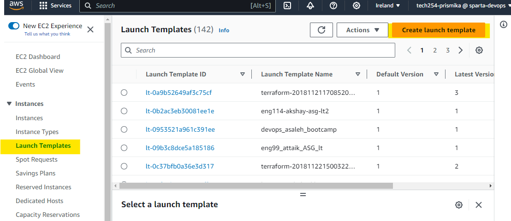

 2) Under Launch template name and description, we want to enter a appropriate name for our template.

    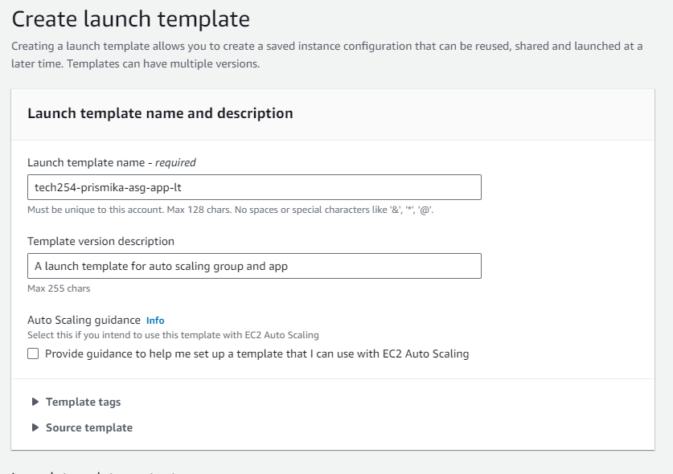

 3) On Application and OS Images, this is where we want to choose our own AMI. So you need to click on My AMIs and search for your ready AMI that you want to use on this template for your instance.

    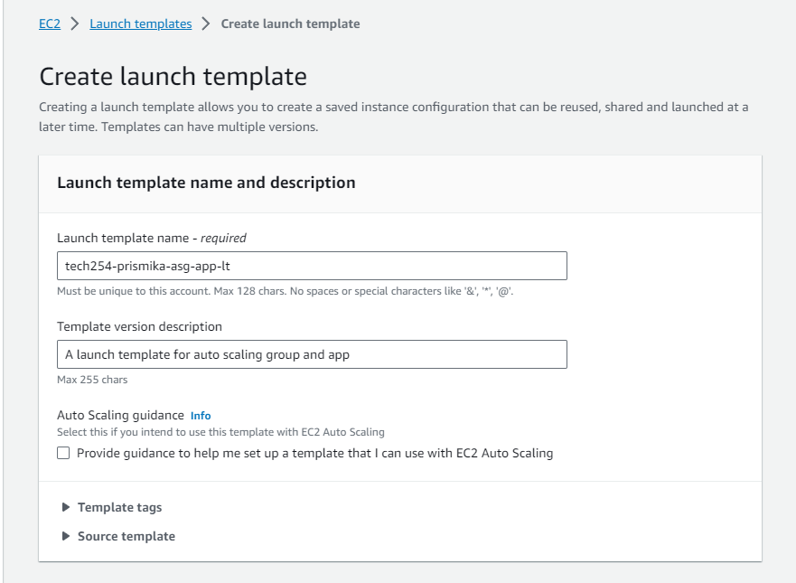

 4) On instance type, we pick **t2.micro**

 5) For key pair (login), I have picked **tech245** to securely connect to my instance.

 6) Under network settings, I have selected my exisiting security group which I have created before. This includes the set of security rules that control the incoming network traffic etc. 

    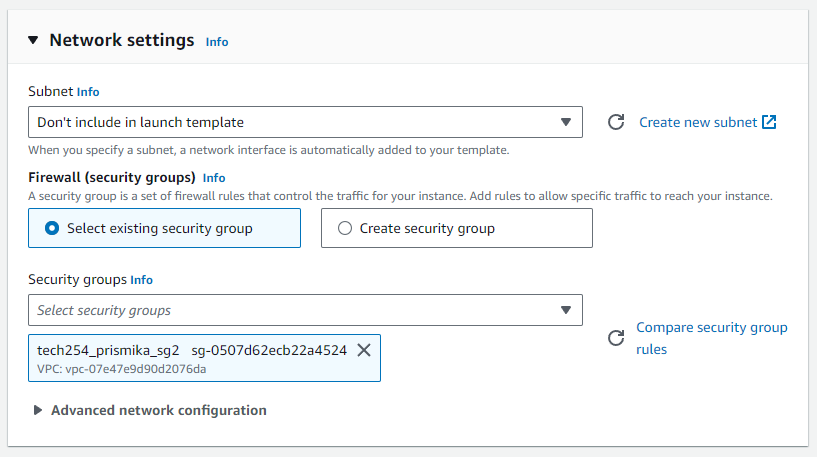

 7) I have left the **storage(volumes)** and **resource tag** as it is and finally under advanced details I have input my user data. **User data** is used with AMI and it will automate and perform the commands when isntance starts.

     Example: 

    ```bash
    #!/bin/bash

    cd /home/ubuntu/repo/app

    npm install

    sudo npm install pm2 -g

    pm2 start app.js
  
    ```

 8) Finally, click on create Launch template. 

 ### Creating an Auto Scaling group 

 1) On the AWS console sidebar, you can find Auto scaling groups at the bottom. Click **create Auto scaling group**.  and fill in a name as well as **choosing your launch template** you created earlier. 

    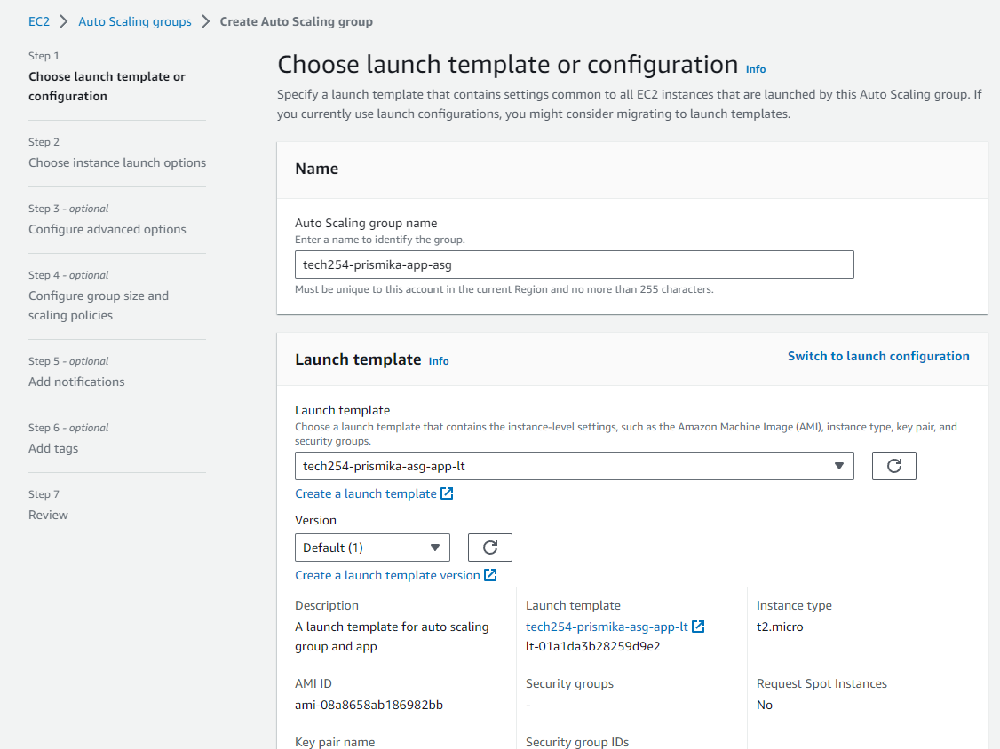

 2) Under network, this is where we choose the Availability Zones and subnets, here I have chosen 3 zones follwed by next.  
 
    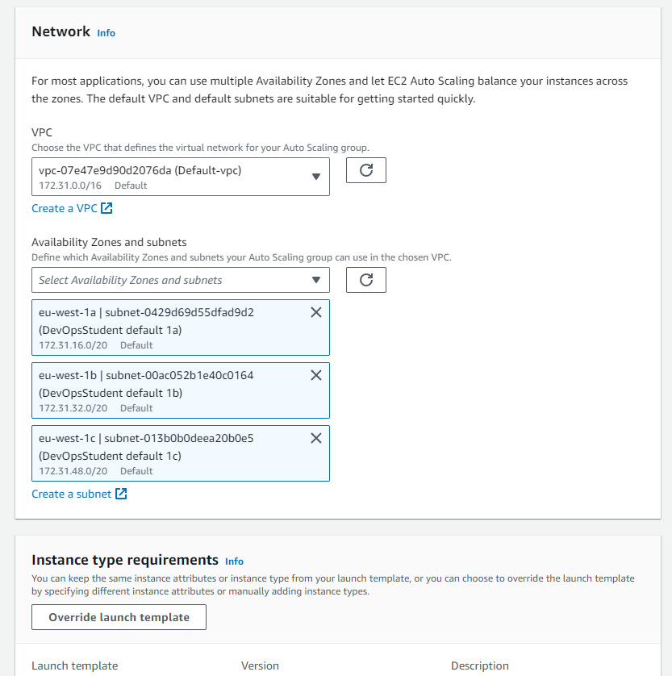

 3) On load balancing, I have created a new load balancer to attach my auto scaling group, below is an example of the name I have given as well as the load balancer type and scheme I have chosen. 

    

4) On the same page, under **listeners and routing** I have created a **target group** in order to forward the default routing. I have named the target group as below. The one selected is HTTP and port 80 as this is the default port for HTTP traffic. When a client makes an HTTP request, it sends the request to the server on port 80 by default.

    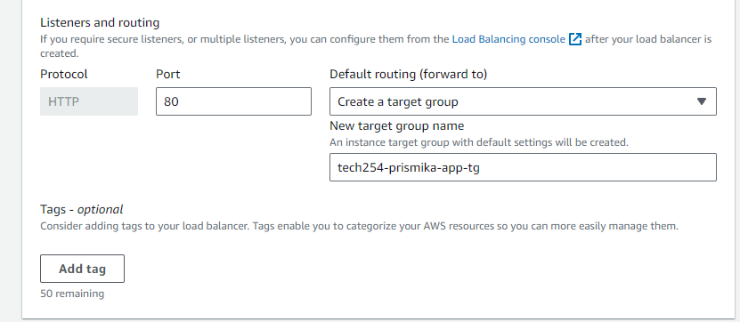

5) Under health checks, I have enabled the recommended option.

    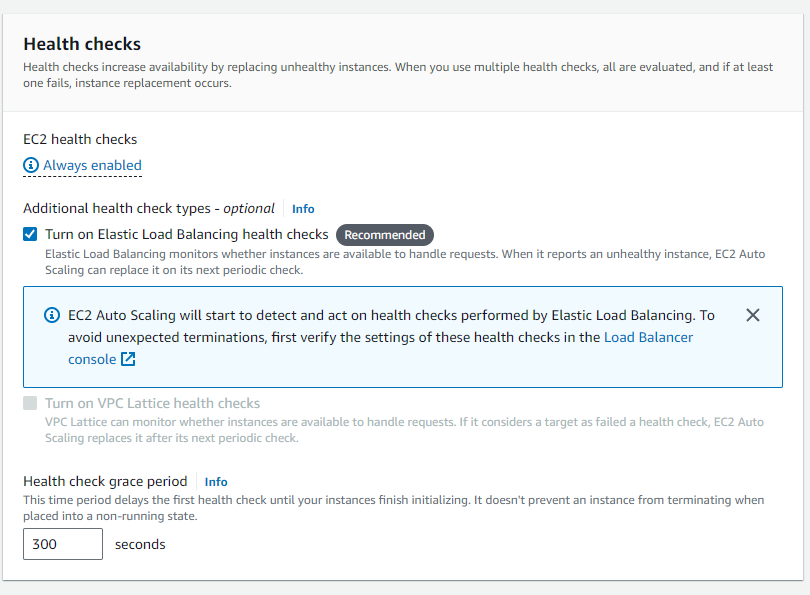

6) For configure group size and scaling policies. I have selected the desired capacity and minimum capicity to be 2 and the maximum capcity to be 3. 
<br>

    **This configuration means that:** 
<br>

    The Auto Scaling group will always maintain a minimum of 2 running instances.
  It will also ensure that the group never exceeds 3 instances at any given time.

    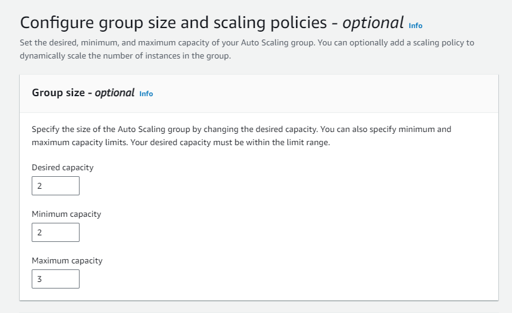

7) I have enabled a target tracking scaling policy with a target value of 50%. This means I'm telling AWS to dynamically adjust the number of instances in my Auto Scaling group to aim for an average CPU utilisation of 50% across all instances. It monitor the average CPU utilisation and take actions to either add or remove instances to maintain this target.

    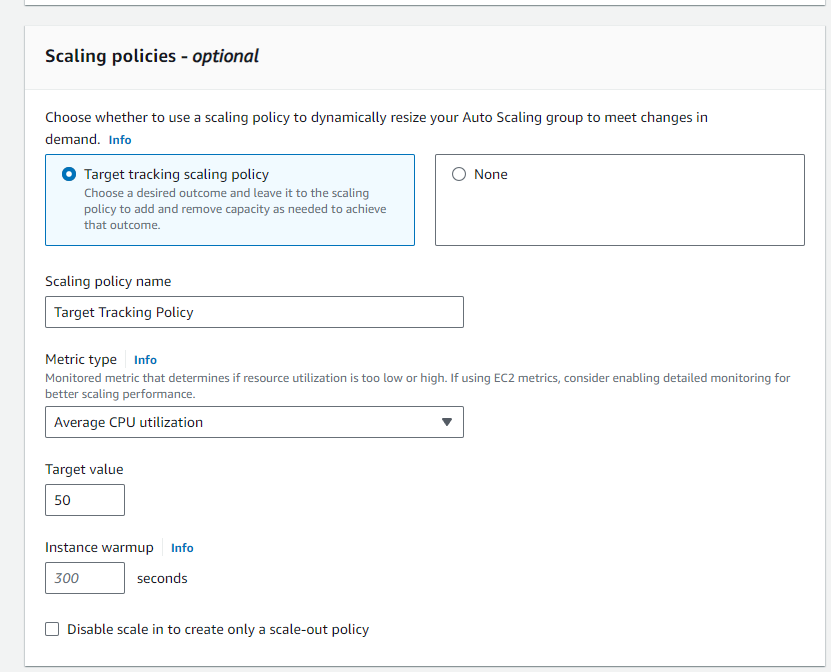

8) Finally, we need to add the tags so we can easily organise,access and manage our resources. You can then click next and review all the information before launching your auto scaling group. 

    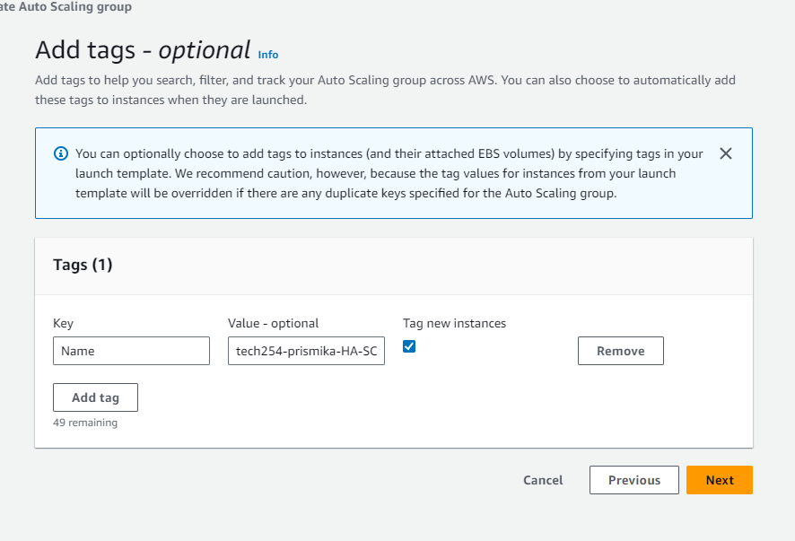

### Load Balancer

A load balancer serves as the single point of contact for clients. The load balancer distributes incoming application traffic across multiple targets, such as EC2 instances, in multiple Availability Zones.

1) Once we have created our auto scaling group, it has autoamtically created our **load balancer** and we can find this on the side bar of our AWS console.

    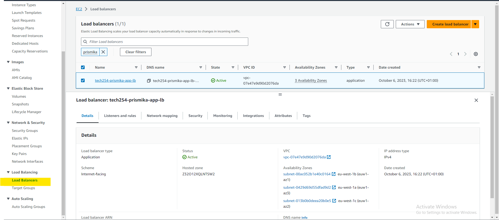

2) You can click on your load balancer ID, where it shown an overview of your load balancer. Under DNS name you can copy and paste your DNS and paste it on your browser URL which then should successfully show your app running.

    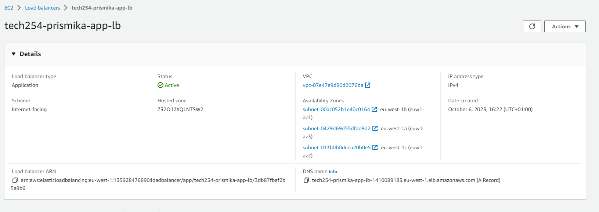

    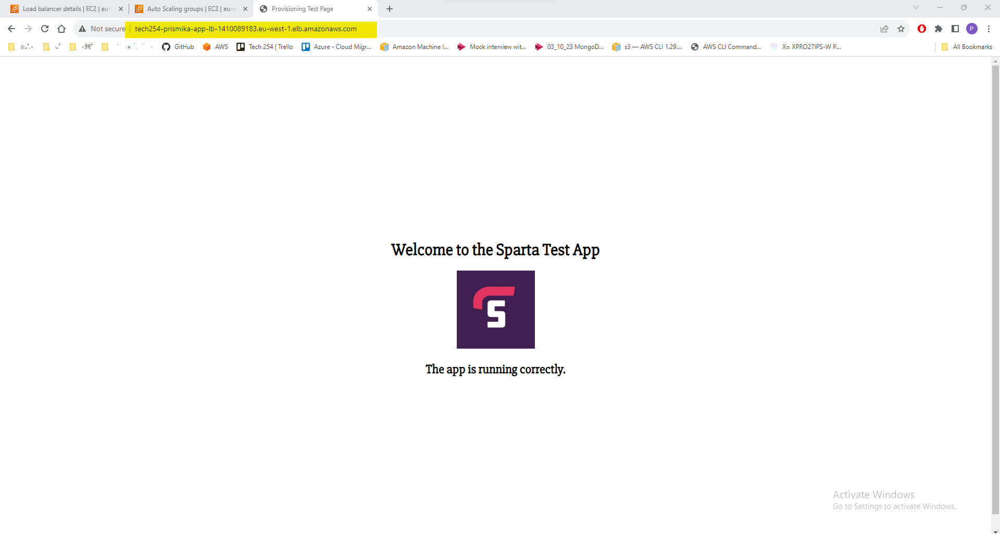

### Target Groups 

As well as automatically creating a load balancer group, it has also created an automatic target group based on our configuration for auto scaling groups. 

So under the target groups option, we should see our target group with the name we gave it. 

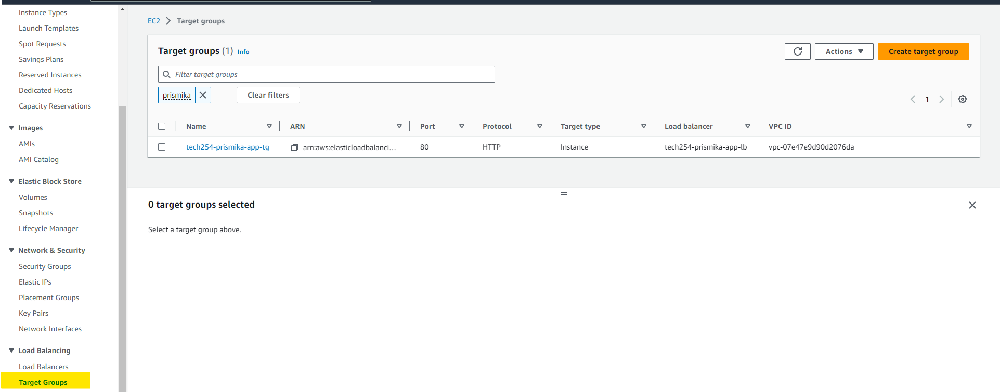

### EC2 Instance 


Finally we should see that we have 2 instances running under our EC2 instance option. This was automatically run based on the conditions we set. If we manually terminate an instance, auto scaling will launch a new one to replace it, as we defined the rule to be maximum 3 capacity. 

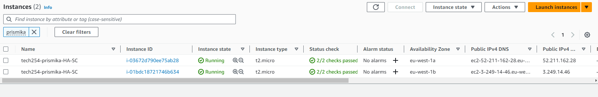

The picture below shows what happens when I manually delete one instance. It has automatically created another one. 

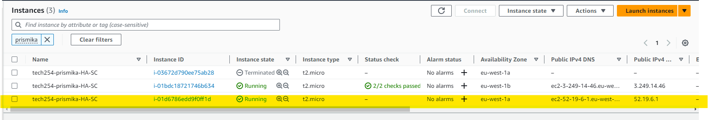
