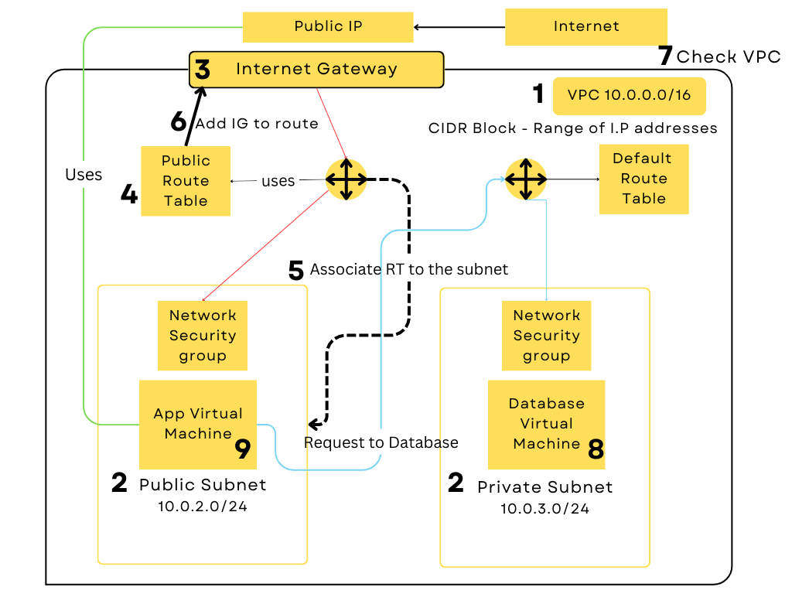

### Virtual Private Cloud (VPC)

#### What is VPC? 

**VPC** stands for Virtual Private Cloud and it  is a **virtual network**. Amazon web service includes a default VPC in each AWS Region. Your default VPCs are configured such that you can immediately start launching and connecting to EC2 instances.  
 
However creating a custom **VPC** means you have greater control over security such configuring IP address range, subnets, route tables etc. 

#### Explaining Virtual Private Cloud

Below i a diagram I have created in order to explain each stages of a VPC. As you can see we are creating a public and a private subnet, so the app virtual machine is linked to the public subnet and the database is linked to the private subnet. We want our database virtual machine to be secure and not allow it to communicate with the internet. 

**Step 1: VPC**

First we need to **create a VPC (Virtual Private Network)**. By creating VPC we are creating a network that we have defined and customised ourselves. We can define a VPC's IP address space from ranges we select. For example 10.0.0.0/16  

**Step 2: Subnet**

 Here you can create subnets and associate with availability zones within a region. You can also create a public and private subnet and have the public subnet communicate with the internet gateway. 

**Step 3: Internet Gateway**

Internet Gateway acts as a bridge between your VPC and the internet. Here you can associate your IGW with your VPC in order to connect your public subnet to the internet. 

**Step 4 , 5, 6 : Route Table**

Route tables are used to control the traffic between subnets to the internet. We can associate subnet to route table by clicking subnet association and selecting your desired subnet (public). We can also set routes that specify the destination and target.

**Step 7: Check VPC** 

We can always go back to our VPC to check and make sure everything is fine. You can check details such as subnets, route tables, associated resousrces etc. 

**Step 8 & 9: Create and Launch Instances with your VPC**

Finally you can create your two EC2 instances, using the VPC you have made and adding a security group. 

  

**Please refer to VPC\creating_vpc.md in order to follow a step by step guide on how to create a VPC.** 