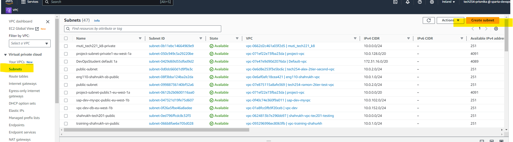
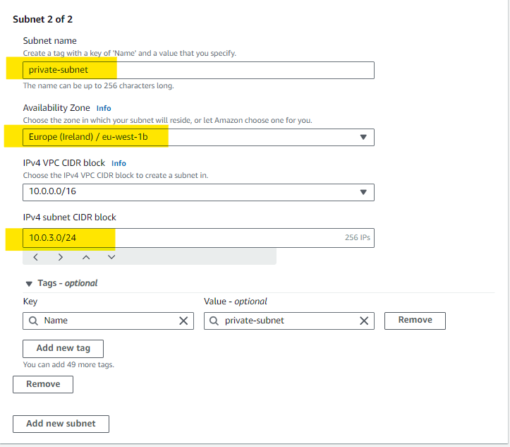
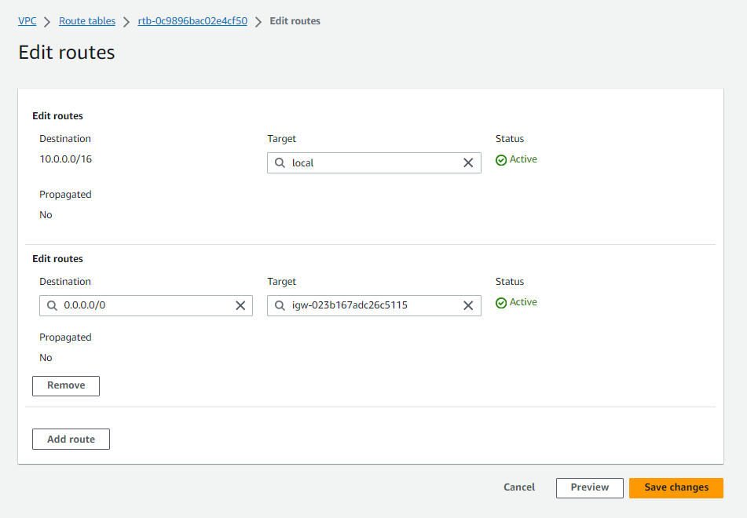
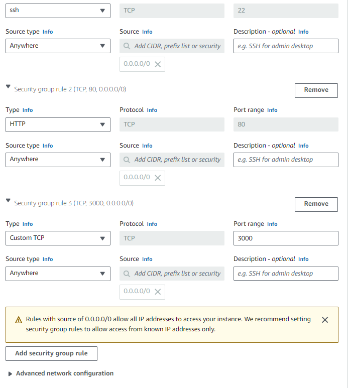

## Creating a VPC (Virtual Private Cloud)

Below I will be going through a step by step guide on how to create a **VPC**. 

1) First log into your AWS console, search for "VPC" in the search bar and select the service. You should then be able to see the VPC dashboard, click **Your VPCs** followed by **Create VPC** on the top.

    

### VPC Settings 

2) You will then be taken to this VPC settings page, I have selected **VPC only** followed by a suitable name for my VPC. I have then entered **10.0.0.0/16** as my IPV4 CIDR block followed by pressing **create VPC** after. 

    

### Subnets

1) On the side bar of the VPC console, you should see Subnets, click on subnets followed by create subnets.
   
    

2) On the **VPC ID**, as soon as you type your name, the VPC you created earlier should automatically be selected from the list, this is your VPC ID.  
    
    

3) Now we are going to create two subnets, one **public**and one **private**. Followed by choosing an availability zone, in this case I have chosen **eu-west- 1a for public subnet** and **eu-west-1b for my private subnet**. We also need to specifiy CIDR block for both subnets. After both subnets have been added, you can click **create subnet**.

    ***Public subnet will be able to communicate with the internet however private subnet will not have direct access to the internet.*** 

    

    

### Internet Gateway 

If you want your VPC to connect to the internet then we need to create an internet gateway.

1) On the side bar of the console, click **Internet gatway** followed by **Create Internet gateway**

    

2) We need to find our name under name tag and select it again from the list. Then click on **create internet gateway**

    

3) Now we need to attach our Internet gateway we created to our VPC. This is done by selecting our IG and clickling on **Attach to VPC**.

    

4) After you have clicked on Attach to VPC, you will get a pop up enabling you to enter your VPC again, simply type your name in and select your VPC from the list followed by attach internet gateway. 

    

### Route Tables 

1) Now we want to create a route table and associate it with our VPC. On the same console, you should see route table on the side bar, after clicking that, click the **create route table.**

    

2) For the name of the route table, we want to give it a clear name- as we are associating our public subnet, I have named it **public -rt** followed by again selecting my VPC after. Then click on **create route table**.

    

 3) After our route table has been created, we need to select the **route** tab at the bottom of the screen and click on **edit routes**. Here we need to add another route as below and type **internet gateway** to find our igw name, select our name and save changes. 

    


 4) Now we need to associate our public subnet. Click on **subnet association** on the bottom tab and you should see both private and public subnet together at the bottom. 
   
    

5) You need to click on **edit subnet association** and select the **public subnet** from the list followed by **save associations**.

    

6) Now, you can see that the public subnet has been associated. 

    

### Launch DB Instance (Private subnet)

1) Now we need to create and launch an EC2 instance for our database. We need to go back to our EC2 console and click on launch instance. 

    

2) Followed by a suitable name for our database as well as selecting our already made **mongodb AMI**. 
   
    

3) Now on the network settings, we need to click edit followed by selecting our **VPC** we made. Since we want our database to be private, we select **private.subnet** followed by disabling auto asssign public IP as its not needed. We also need to create a new security group within our VPC, I made sure to give it a suitable name  so I can find it next time. 
   
    

4) Now you need to add an inbound security rule for Mongodb as this port is where our database is. I have added a custom TCP with port 27017 amd source type anywhere. 

    

### Launch App Instance (Public subnet)

Now after creating our DB instance, we need to create our App instance. 
We follow the same process by launching and creating a new instance.

1) I have given it a suitable name followed by selecting an app AMI that I have already created. 
   
    


2) Under networking settings, I have selected the VPC I created, followed by selecting     **public.subnet** this time, I have also selected **enable** auto-asssign public IP as we need to access it through the internet and finally created a new security group with new security inbound rules. 

    

3) For the security rule here, I have added HTTP 80 to communicate with web server and port 3000 for our nginx server.
   
    

4) Finally, I have added the following commands on the user data in order to automate the initial setup of my instance.
    ***You need to make sure that you replace the IP value with your mongodb private IP.***
   
    ```
    #!/bin/bash

    #exporting the db's private IP
    export DB_HOST=mongodb://10.0.3.187:27017/posts

    cd /home/ubuntu/repo/app

    npm install

    #seed database
    node seeds/seed.js

    #install pm2
    sudo npm install pm2 -g
    pm2 start app.js
    ```

    

### Testing VPC

1) We can finally test that the app and db is working or not in our VPC by going into our app instance and copy and pasting our **public IP** address into our browser. Hopefully, your app should be showing as below.
   
    Example:

    

    

2) Now, to check if the database is working or not, we type `/posts` after our IP address and the database page should be shown as below. 

    Example: 

    