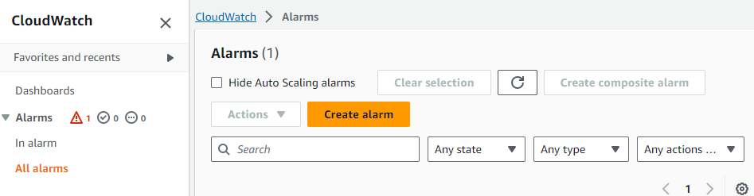
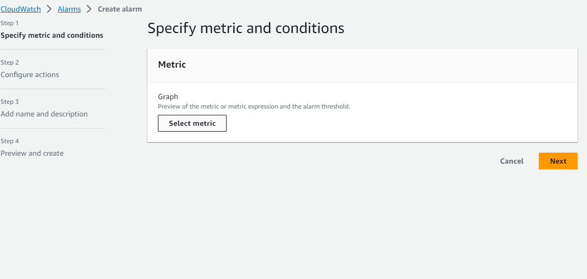
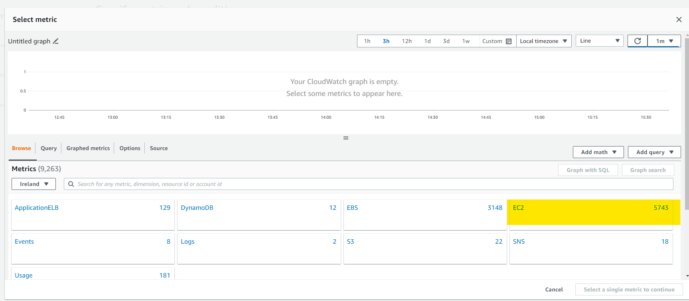
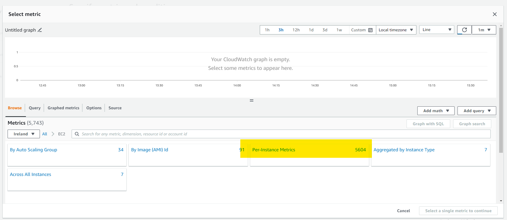
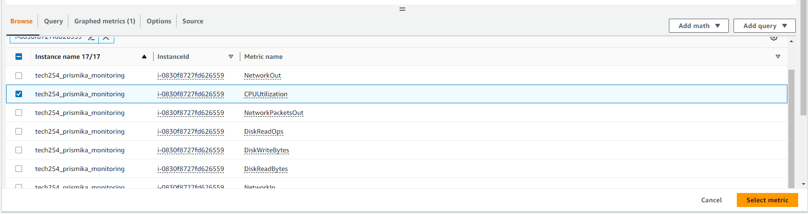
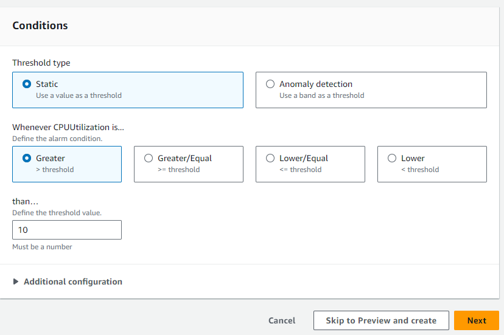
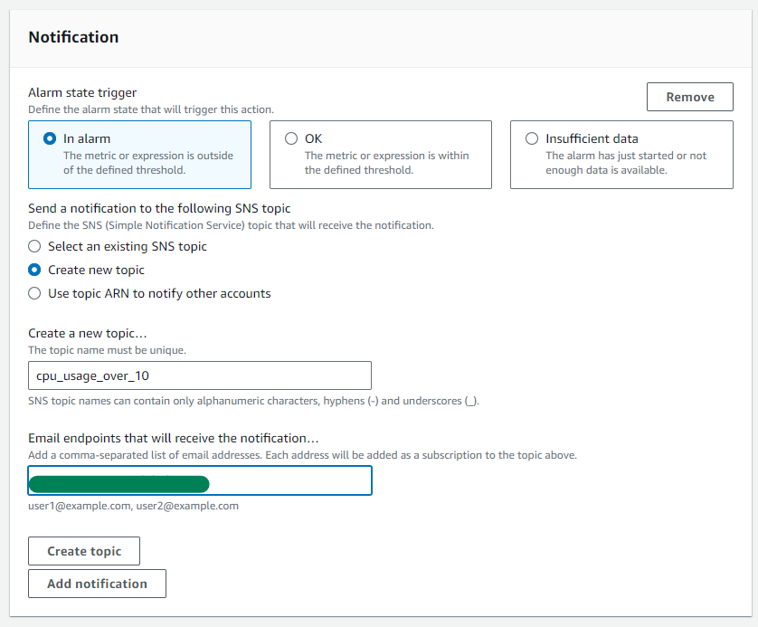
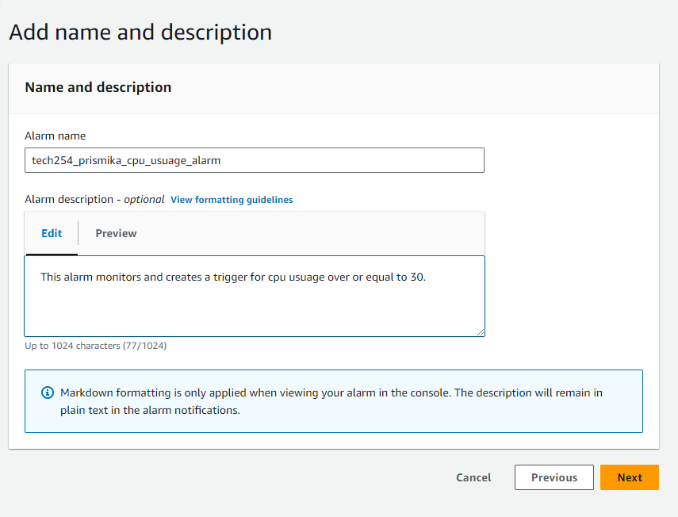
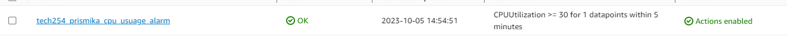
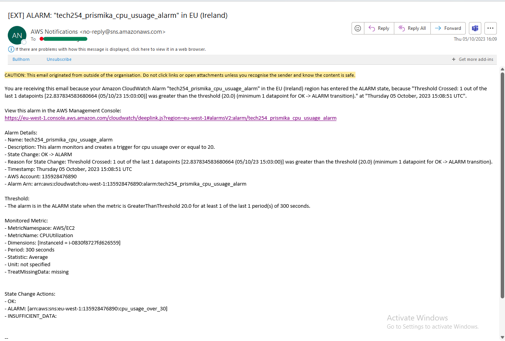

## How to create a CPU usage alarm for your EC2 instance.

Below, I will be showing you how to create and set up a CPU usage alarm. When the average CPU use of your EC2 instance exceeds the speicifed threshold an alarm will be triggered and a notification will be sent to your email.

1) First you need to open up the CloudWatch console, on the side bar and click **all alarms** followed by **create alarm**.

    

2) Then select **choose metric**

    

3) Under the all metrics tab, click on **EC2 metric** followed by **Pre-Instance metric** after. 

    

    

4) In this bit, you need to find your **EC2 instance ID** on the InstanceId column and select on the **CPUUtilization** on the Metric Name column then **select metric** after.
 ***You can find your instance ID on the instances on your EC2 dashboard.*** 

    Example:  

    

5) Under **specify metric and conditions**, for statistic I have chosen **Average** and **5 min** for the period. 
For the condition, I have chosen **static** for threshold type and I have chosen to trigger the alarm whenever CPUUtilzation is **greater than 10** followed by next. 

    

6) Under notification, I have selected **in alarm** to define the alarm state that will trigger this action and created a new topic to receieve my notification. I have named my new topic **cpu_usuage_over_10** followed by my email where I want to receive this notification. 

    

7) You will then need to enter a name for your alarm and an optional description followed by next. 

    

8) Finally, it will show you a overview summary of your alarm and you can go back to the alarm dashboard to find your created alarm. 
***Do not forget to subscribe to the notification that has been sent to your email in order to receive email notification from your alarms***

    

9) Below is an notification sent to my email when an alarm was triggered due to the CPU usage exceeding over 10%. 

    

